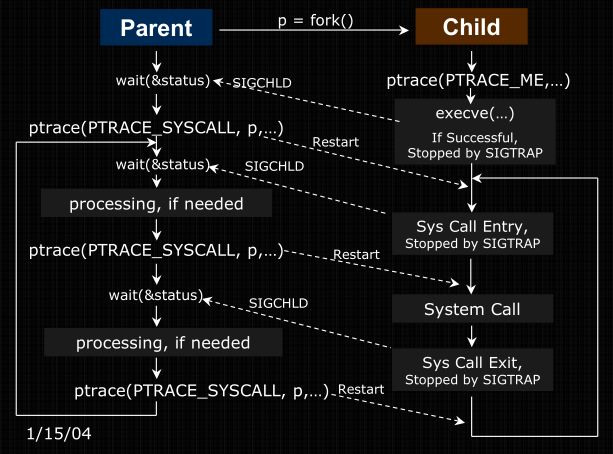

# system call tracing using `ptrace`
## synopsis

```c
#include <sys/ptrace.h>

long int ptrace(enum __ptrace_request request,
                pid_t                 pid,
                void *                addr,
                void *                data)
```
## description

the `ptrace` syscall provides means by which a parent process can observe and
manipulate the execution of another process. it can examine and change its core
image and registers. it's primarily used to implement breakpoint debugging and
system call tracing.

- `request`: determines what action to perform
- `pid`: is the process to be traced
- `addr`: an address in USER SPACE of the traced process
    1. wherein `data` may be written to if instructed to do so
    2. from where a word is read and returned as the result of the `ptrace`
       syscall

# `ptrace` request selection

## `PTRACE_TRACEME`

only used by a child process when it is to be traced by its parent. any signal,
except for `SIGKILL`, delivered to the process causes it to stop and the parent
notified with `wait`. subsequent successful calls to `exec` by this process will
cause a `SIGTRAP` to be sent to it

## `PTRACE_SYSCALL`

restarts a stopped child and arranges for it to be stopped at the next entry to
or exit from a system call. from the parent's perspective, the child will appear
to have been stopped by `SIGTRAP`

## `PTRACE_PEEKDATA`

reads and returns the word at the location `addr` in the child's memory

## `PTRACE_POKEDATA`

copies a word from location `data` in the parent's memory to the location `addr`
in the child's memory

## `PTRACE_GETREGS`

- more OS and architecture dependant

reads general purpose registers of the child process into the location `data` of
the parent

# system call tracing



# case study

modifying the path parameter of the `open` system call

## steps

1. use the `PTRACE_SYSCALL` request to trace into the entry to a syscall in the
   child process
2. use the `PTRACE_GETREGS` request to get the general purpose (gp) registers of
   the child process
3. retrieve the syscall number from the 'gp' to ensure it _is_ an `open` syscall
4. retrieve the `addr` of the path parameter from the 'gp' and use the
   `PTRACE_PEEKDATA` request to get the path at location `addr` of the child's
   memory
5. modify the path and use `PTRACE_POKEDATA` to write the path `data` back to the
   location `addr` of the child's memory
6. restart the stopped child process

## implementation details

### system call convention
### user register struct
### tracing startup
### obtaining the `open` syscall parameters
